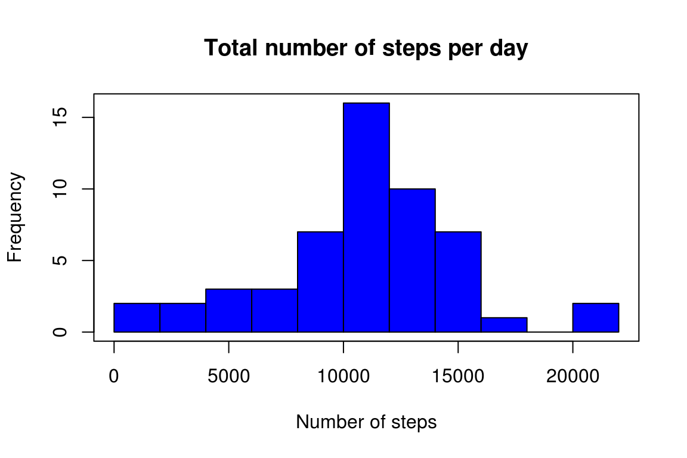
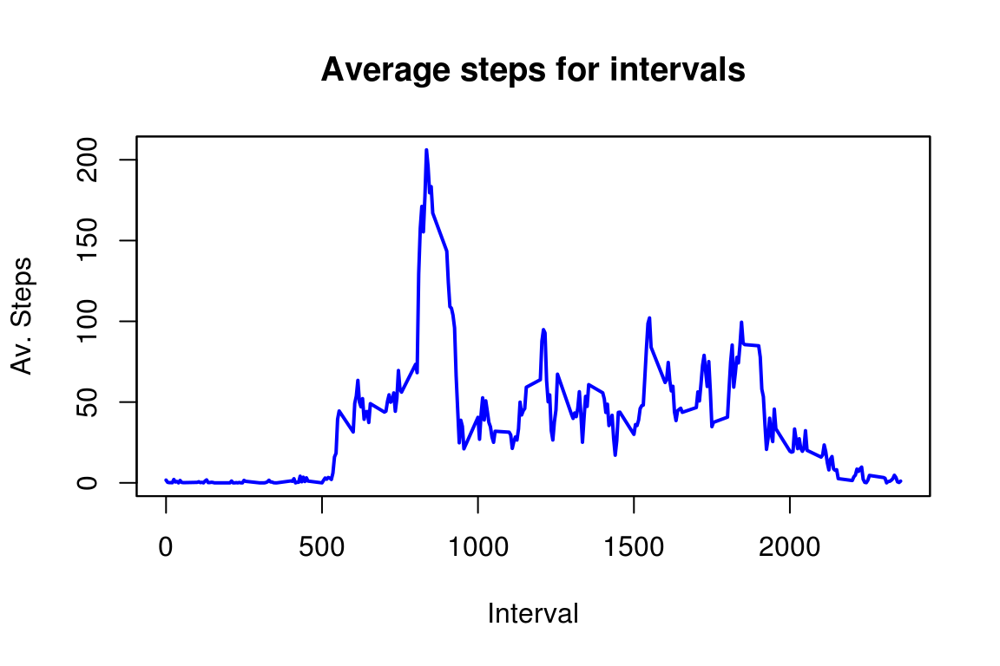

# Reproducible Research: Peer Assessment 1
Ivana Seric  
August 9, 2015  


This is the first project for "Repsoducibe Research" course, fifth course in the Coursera "Data Science" specialization. 


```r
setwd('~/R/Reproducible_research/RepData_PeerAssessment1/')
library(plyr)
library(lubridate)
```

## Loading and preprocessing the data

1. Load the data


```r
data_download <- mdy("August 9, 2015")
myData <- read.csv("activity.csv")
```

The data was downloaded from the coarse website on 2015-08-09.

2. Process/transform the data (if necessary) into a format suitable for your analysis


```r
# data already is tidy
```


## What is mean total number of steps taken per day?

For this part of the assignment, you can ignore the missing values in the dataset.  

1. Calculate the total number of steps taken per day

```r
totalsByDay <- ddply(myData, "date", numcolwise(sum))$steps
```

2. Make a histogram of the total number of steps taken each day 

```r
hist(totalsByDay, col="green", ann=FALSE, breaks = 10)
title(xlab="Number of steps", ylab="Frequency", main="Total number of steps per day")
```

 

3. Calculate and report the mean and median of the total number of steps taken per day

```r
stepsMean <- mean(totalsByDay, na.rm = TRUE)
stepsMedian <- median(totalsByDay, na.rm = TRUE)
```

The mean of the total number of steps taken per day is 1.0766189\times 10^{4}, 
and the median is 10765

## What is the average daily activity pattern?


1. Make a time series plot (i.e. type = "l") of the 5-minute interval (x-axis) and the average number of steps taken, averaged across all days (y-axis)

```r
sumByInterval <- ddply(myData, "interval", na.rm = TRUE, numcolwise(sum))
numOfdays <- length(totalsByDay)
plot(sumByInterval$interval, sumByInterval$steps/numOfdays, type = "l", col = "red", lwd = 2, ann=FALSE)
title(xlab="Interval", ylab="Av. Steps", main="Average steps for intervals")
```

 

2. Which 5-minute interval, on average across all the days in the dataset, contains the maximum number of steps?


```r
maxIndex <- which(max(sumByInterval$steps, na.rm = TRUE)==sumByInterval$steps, arr.ind = TRUE)
maxInterval <- sumByInterval$interval[maxIndex]
timeHour <- maxInterval %/% 100
timeMinute <- maxInterval %% 100
```

Time interval  8:35 - 8:40 contains the maximum number of steps.


## Imputing missing values

1. Calculate and report the total number of missing values in the dataset (i.e. the total number of rows with NAs)


```r
numNAs <- sum(is.na(myData$steps))
```

The total number of missing values is 2304.

2. Devise a strategy for filling in all of the missing values in the dataset. The strategy does not need to be sophisticated. For example, you could use the mean/median for that day, or the mean for that 5-minute interval, etc.


3. Create a new dataset that is equal to the original dataset but with the missing data filled in.

4. Make a histogram of the total number of steps taken each day and Calculate and report the mean and median total number of steps taken per day. Do these values differ from the estimates from the first part of the assignment? What is the impact of imputing missing data on the estimates of the total daily number of steps?

## Are there differences in activity patterns between weekdays and weekends?
